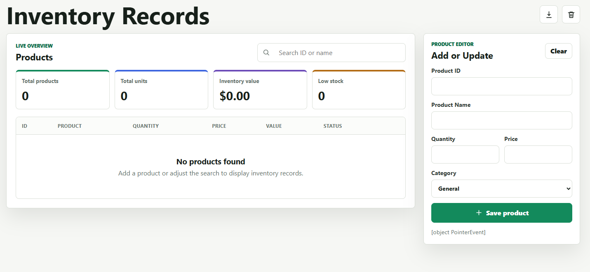

# Inventory Records

A simple inventory management web app for tracking product records. Users can add, update, search, delete, clear, and export inventory items from the browser.

Live App: https://inventory-records-seven.vercel.app



## Features

- Add products with ID, name, quantity, price, and category
- Update existing product records
- Search products by ID or name
- View total products, total units, inventory value, and low-stock count
- Delete individual products
- Clear all inventory records
- Export inventory data as a CSV file

## Tech Used

- HTML
- CSS
- JavaScript
- Browser localStorage

## Project Files

- `index.html` - main web page
- `styles.css` - page styling
- `app.js` - inventory logic
- `package.json` - local development script

## Run Locally

Open `index.html` in a browser, or run:

```bash
npm run dev
```

Then visit:

```text
http://127.0.0.1:4173
```
